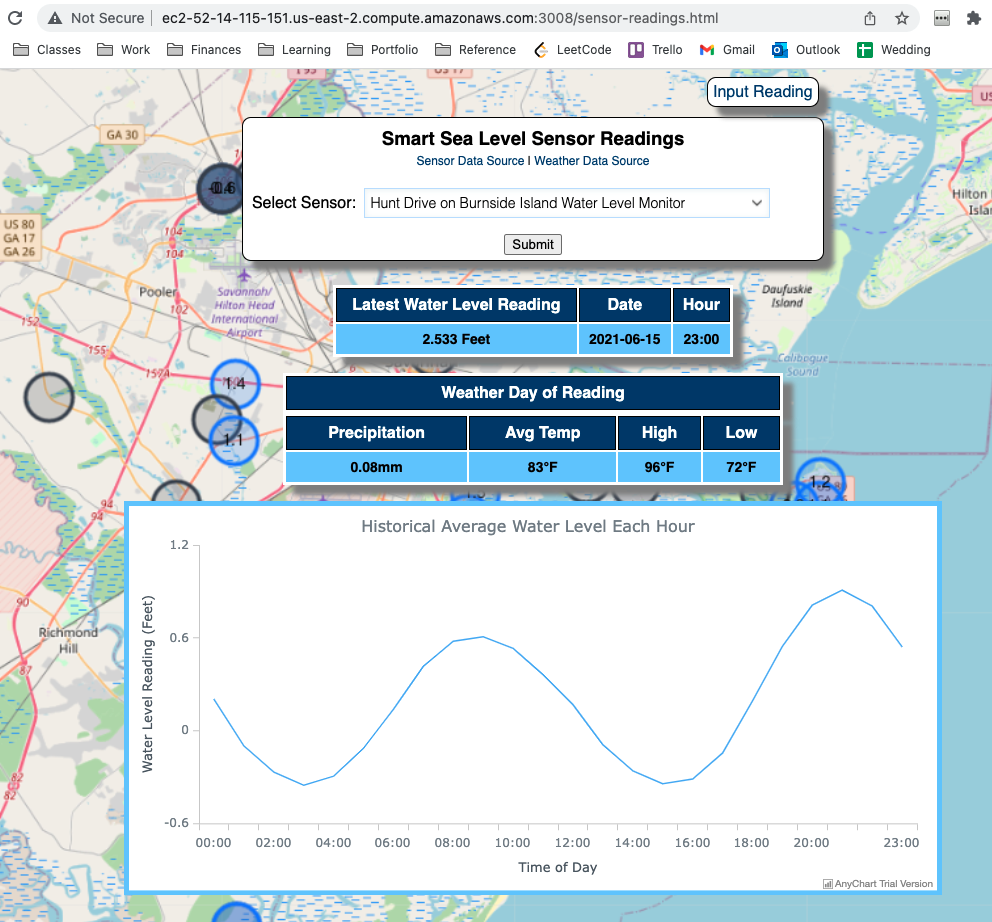
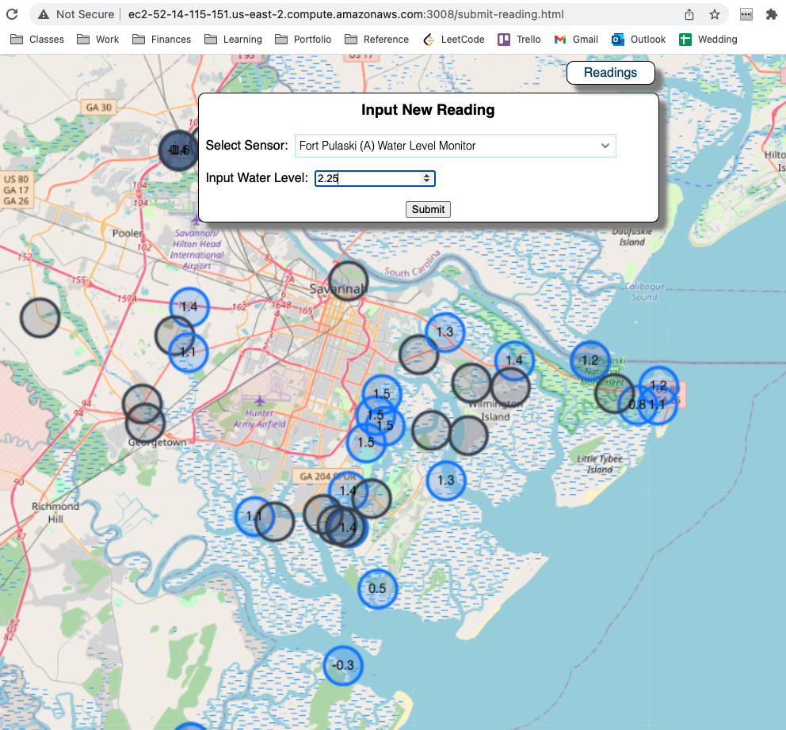

# Smart Sea Level Sensors Dashboard
MPCS 53014: Big Data Application Architecture - Final Project

### Project Description

The motivation for this project was to build a scalable big data application with Lambda architecure. I chose to build a very basic dashboard which displays data from the Smart Sea Level Sensors project (https://www.sealevelsensors.org/) along with associated local Savannah, GA weather data from NOAA (https://www.ncdc.noaa.gov/cdo-web/search). The project has four layers: the batch layer, the serving layer, the speed layer, and the UI layer, as described below.

Technologies used: HDFS, HQL, Apache HBase, Apache Spark, Apache Kafka, Scala, Node.js, Mustache templates, Shell scripts, AWS EC2/EMR

Note: The speed layer of this application is limited, as it is achieved by manually inputting a sensor's water level reading in the web app, which will then increment the ```cwbryant_hourly_totals_view``` table (visualized in the line graph on the web app). Future iterations would have both sensor and weather data streamed in directly from the Smart Sea Level Sensors and NOAA APIs via ingestion programs.

### Running Application Screenshots

Sensor Readings Page



Reading Submission Page



### How to Run Deployed Application

The deployed web application can be found at http://ec2-52-14-115-151.us-east-2.compute.amazonaws.com:3008/sensor-readings.html, currently running in ```cwbryant/ui-layer/``` in a ```screen``` window. 

To initiate the speed layer streaming:
* ```cd``` into the ```/cwbryant/final_project directory```
* submit the spark job with command: 
```spark-submit --master local[2] --driver-java-options “-Dlog4j.configuration=file:///home/hadoop/ss.log4j.properties" --class StreamReadings /home/hadoop/cwbryant/final_project/uber-speed-update-views—1.0-SNAPSHOT.jar b-2.mpcs53014-kafka.198nfg.c7.kafka.us-east-2.amazonaws.com:9092,b-1.mpcs53014-kafka.198nfg.c7.kafka.us-east-2.amazonaws.com:9092```

New sensor reading data can be inputted in the web app at http://ec2-52-14-115-151.us-east-2.compute.amazonaws.com:3008/submit-reading.html. The data will be pushed onto the ```cwbryant_readings``` Kafka topic, and the spark job will increment the relevant view.

### Building the Application

#### Batch Layer

The batch layer is responsible for downloading data, ingesting it into HDFS, and then creating the relevant Hive/ORC tables. To build the batch layer, in the EMR cluster: 
* ```cd``` into ```batch-layer``` directory
* Run ```sh get-data.sh``` to download the sensor data. Please note that the weather data was downloaded locally from https://www.ncdc.noaa.gov/cdo-web/datasets/GHCND/stations/GHCND:USW00003822/detail with dates starting June 1, 2019 to present and then ```scp```'d to this directory in the cluster. This data is included in the ```batch-layer``` directory since the CSV is very small.
* Then, run ```sh ingest-data.sh``` to ingest the datasets into HDFS under ```/cwbryant/final/project/``` in their own directories.
* Finally, run ```sh create_tables.sh``` to create the relevant Hive/ORC tables. The CSV Hive tables are named ```cwbryant_sensor_csv``` and ```cwbryant_weather_csv```, and the ORC tables are named ```cwbryant_sensor``` and ```cwbryant_weather```.

#### Serving Layer

The serving layer is responsible for computing the batch views and storing them in HBase to serve. To recompute the batch views:
* In the ```serving-layer``` directory run ```sh run-serving.sh```. This will invoke the scala scripts to compute the batch view tables and move them into HBase via the HQL scripts. The HBase tables are named ```cwbryant_latest_readings_view``` and ```cwbryant_hourly_totals_view```.

#### Speed Layer

The speed layer is responsible for streaming in new sensor reading data and incrementing the relevant batch view. The speed layer producer is implemented as part of the Node.js app via user submission with the Kafka client. The speed layer consumer can be initiated by: 
* Building the uber-speed-update-views—1.0-SNAPSHOT.jar uber jar from the ```speed-layer-consumer``` module
* Running the spark-submit command given in the "How to Run Deployed Application" section above. 

#### UI Layer

The UI layer displays the HBase views via a Node.js web application. To build the UI layer:
* ```cd``` into the ```ui-layer``` directory
* run ```npm install```
* Then, the server can be started in ```screen```/```tmux``` with ```node app.js 3008 172.31.39.49 8070```.
